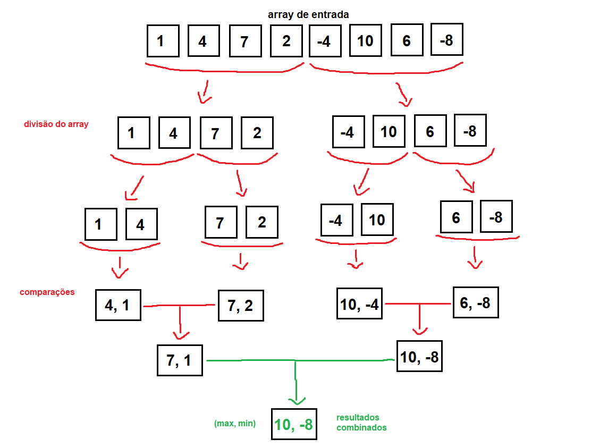

# MaxMin Select - Algoritmo de Seleção Simultânea do Maior e do Menor Elementos

## Informações do Projeto
- **Disciplina:** Fundamentos de Projeto e Análise de Algoritmos - PUC Minas
- **Professor:** João Paulo Carneiro Aramuni
- **Autor:** Lucas Ferreira Garcia

## Descrição do Projeto
Este projeto implementa o algoritmo **MaxMin Select**, que encontra simultaneamente o maior e o menor elemento de uma lista utilizando a abordagem de **divisão e conquista**. Esse método reduz o número de comparações em relação a uma abordagem ingênua, tornando a solução mais eficiente.

### Estrutura dos Arquivos
- **`main.py`**: Contém a implementação do algoritmo MaxMin Select.
- **`README.md`**: Documentação detalhada sobre o projeto, explicação do código, análise da complexidade e instruções de execução.
- **`test_maxmin.py`**: Arquivo de testes unitários para validar o funcionamento do algoritmo.

### Lógica do Algoritmo
1. **Caso base**:
   - Se a lista tem apenas um elemento, o maior e o menor são o próprio elemento.
   - Se a lista tem dois elementos, basta compará-los diretamente para determinar o menor e o maior.
2. **Divisão**:
   - A lista é dividida em duas metades.
3. **Conquista**:
   - O algoritmo é chamado recursivamente para encontrar o menor e o maior elemento de cada metade.
4. **Combinação**:
   - O menor global é o menor entre os menores das duas metades.
   - O maior global é o maior entre os maiores das duas metades.

### Explicação do Código Linha por Linha
1. **Definição da Função:**
   ```python
   def selecao_maxmin(arr):
   ```
   - Define a função `selecao_maxmin`, que recebe uma lista `arr` de números como entrada.

2. **Caso Base - Lista com um Elemento:**
   ```python
   if len(arr) == 1:
       return arr[0], arr[0]
   ```
   - Se a lista contém apenas um número, ele é tanto o menor quanto o maior.

3. **Caso Base - Lista com Dois Elementos:**
   ```python
   if len(arr) == 2:
       return (arr[0], arr[1]) if arr[0] < arr[1] else (arr[1], arr[0])
   ```
   - Se a lista contém dois números, eles são comparados e retornados na ordem correta (menor, maior).

4. **Divisão da Lista:**
   ```python
   meio = len(arr) // 2
   ```
   - Calcula o índice do meio da lista para dividi-la em duas partes.

5. **Chamada Recursiva para Cada Metade:**
   ```python
   menor_esq, maior_esq = selecao_maxmin(arr[:meio])
   menor_dir, maior_dir = selecao_maxmin(arr[meio:])
   ```
   - Aplica a função `selecao_maxmin` recursivamente na primeira metade (`arr[:meio]`).
   - Aplica novamente a função na segunda metade (`arr[meio:]`).
   - Isso permite resolver subproblemas menores antes de combiná-los.

6. **Combinação dos Resultados:**
   ```python
   menor_total = min(menor_esq, menor_dir)
   maior_total = max(maior_esq, maior_dir)
   ```
   - O menor elemento final é o mínimo entre os menores encontrados nas duas metades.
   - O maior elemento final é o máximo entre os maiores encontrados nas duas metades.

7. **Retorno do Resultado:**
   ```python
   return menor_total, maior_total
   ```
   - Retorna o menor e o maior elemento encontrados.

8. **Execução do Programa Principal:**
   ```python
   if __name__ == "__main__":
   ```
   - Verifica se o script está sendo executado diretamente (não importado como módulo).

9. **Definição da Lista de Entrada:**
   ```python
   sequencia = [3, 5, 1, 9, 2, 8, 4, 7]
   ```
   - Define uma lista de números para teste.

10. **Chamada da Função e Impressão dos Resultados:**
    ```python
    menor, maior = selecao_maxmin(sequencia)
    print(f"Menor elemento: {menor}")
    print(f"Maior elemento: {maior}")
    ```
    - Chama `selecao_maxmin(sequencia)` para encontrar os elementos mínimo e máximo.
    - Exibe os resultados na tela.

## Como Executar o Projeto
### Requisitos
- Projeto realizado na versão do Python 3.13.2

### Passos para executar
1. Clone o repositório:
   ```sh
   git clone <URL_DO_REPOSITORIO>
   cd <NOME_DO_REPOSITORIO>
   ```
2. Execute o código principal:
   ```sh
   python main.py
   ```
3. Para rodar os testes:
   ```sh
   python -m unittest test_maxmin.py
   ```

## Relatório Técnico

### Análise da Complexidade Assintótica do Algoritmo `selecao_maxmin`

#### 1. Contagem de Operações e Complexidade O(n)
O algoritmo `selecao_maxmin` utiliza a estratégia de divisão e conquista para encontrar o menor e o maior elemento de um array. Vamos analisar o número de comparações realizadas:

**Casos Base:**
- Se `len(arr) == 1`: Nenhuma comparação é feita.
- Se `len(arr) == 2`: Apenas 1 comparação para determinar o menor e o maior.

**Divisão Recursiva:**
- O array é dividido em duas metades (`arr[:meio]` e `arr[meio:]`), gerando duas chamadas recursivas.

**Combinação dos Resultados:**
- São feitas **duas comparações**:
  - `min(menor_esq, menor_dir)` → **1 comparação**
  - `max(maior_esq, maior_dir)` → **1 comparação**
- Total por nível: **2 comparações**.

**Recorrência:**
Podemos expressar a recorrência do número total de comparações como:
```math
T(n) = 2T(n/2) + 2
```
Usando substituições sucessivas, obtemos:
```math
T(n) = n - 1
```
Portanto, a complexidade assintótica é **O(n)**, pois o número de comparações cresce linearmente com `n`.

---

#### 2. Aplicação do Teorema Mestre
A recorrência do algoritmo é:
```math
T(n) = 2T(n/2) + O(1)
```
Comparando com a forma geral do Teorema Mestre:
```math
T(n) = aT(n/b) + f(n)
```
- **a = 2** (número de chamadas recursivas)
- **b = 2** (divisão do problema)
- **f(n) = O(1)** (comparações adicionais)

**Cálculo do logaritmo:**
```math
p = log_2(2) = 1
```
Como **f(n) = O(1) = O(n^0)**, temos **p = 0**. Comparando `p` com `log_b(a)`, vemos que `p < log_b(a)`, então aplicamos o **Caso 1** do Teorema Mestre:
```math
T(n) = O(n)
```
Portanto, confirmamos que a complexidade do algoritmo é **O(n)**.

## Diagrama de divisão e combinação
Abaixo o diagrama ilustrando a divisão e combinação no algoritmo MaxMin Select:



## Referências 
- AULA 01_Análise de complexidade de algoritmos.pdf